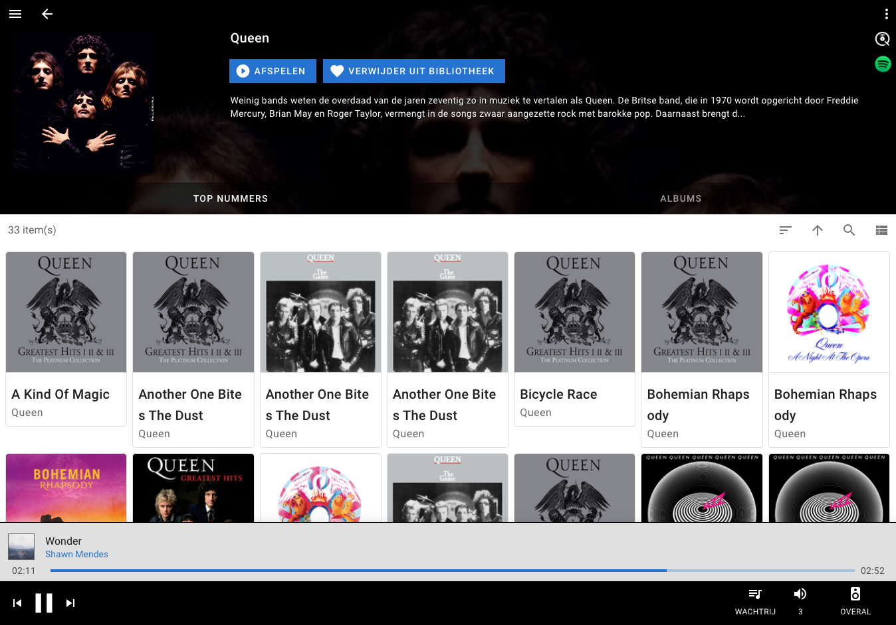

## Music Assistant

Music Assistant is the ultimate music library manager and steamer.
The current state is BETA (for technical enthousiasts only) but an official, stable release is soon to be expected.

**Key features:**
- Stream your favourite music to all of your speakers around the house, even mix and match different brands/types.
- Support for multiple streaming services AND local files.

### Features

- Modern architecture, build from the ground up using latest technologies.
- Based on SoX, for all audio manipulations.
- Engineered with (no nonsense) high audio quality in mind, including Hi-Res support.
- Plugin architecture to easily add streaming providers (source) and player providers (target).
- Support for rich metadata using metadata providers like Fanart.tv.
- Currently supported music providers: Local files, Spotify, Qobuz, Tune-In.
- Currently supported player providers: Sonos, Chromecast, Squeezebox (compatible) players.
- Very fast while consuming little resources. The server even runs on a raspberry Pi. 
- [Home Assistant integration](https://github.com/music-assistant/hass-integration).

**Music Assistant Server** 

The [server](https://github.com/music-assistant/server) is the beating hart, the core of Music Assistant and must run on an always-on device like a Raspberry Pi, a NAS or an Intel NUC or alike.
At this moment (beta phase) a [docker image](https://hub.docker.com/repository/docker/marcelveldt/music-assistant) is available as well as a [Home Assistant addon](https://github.com/marcelveldt/hassio-addons-repo) to get started very quickly. 
While working towards official release, more installation options will become available.

**Music Assistant Apps**

The Music Assistant frontend is created in Vue and is/will be available as both webapp and native apps.
The webversion of the frontend is included in the server.

### Please stay tuned!
If you're willing to give the beta version a try, go ahead and grab the docker or Home Assistant addon.
Keep an eye on the info page about the release of the official/final first version!

### Screenshots

